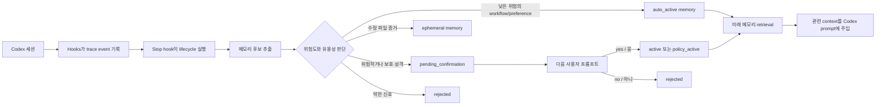
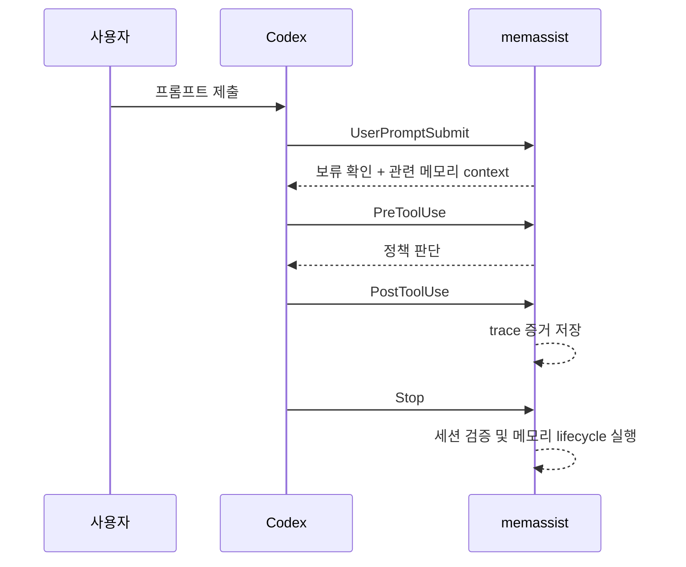
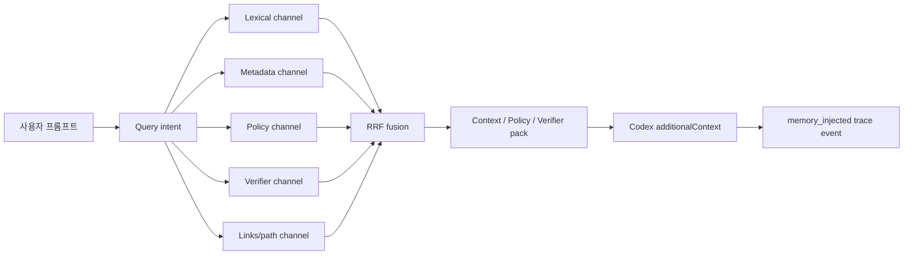
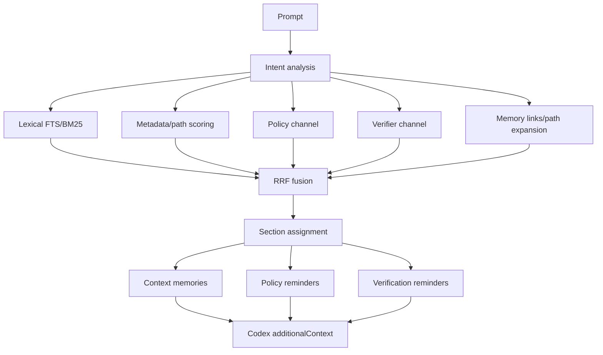
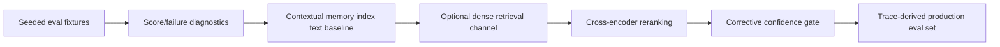

# memassist

`memassist`는 Codex를 위한 로컬 메모리 어시스턴트입니다. Codex 세션을
hooks로 기록하고, 기억할 만한 후보를 추출하고, 프로젝트 단위 메모리를
관리하며, 다음 프롬프트에 관련 기억을 다시 넣어 줍니다. 사용자가 승인한
보호 규칙은 프로젝트 정책으로 승격할 수도 있습니다.

반복해서 같은 프로젝트 규칙과 검증 방법을 Codex에 설명하지 않으려는 일반
사용자를 위해 만든 도구입니다.

> 현재 상태: 초기 로컬 도구입니다. CLI와 저장 구조는 사용할 수 있지만,
> 위험도가 높은 프로젝트에서는 생성된 메모리와 정책 변경을 직접 검토한 뒤
> 신뢰하는 것이 좋습니다.

## 무엇을 하나요

- Codex 도구 사용 내역을 로컬 trace event로 기록합니다.
- 완료된 세션에서 메모리 후보를 추출합니다.
- 위험도가 낮은 workflow 또는 preference 메모리를 자동 활성화합니다.
- 위험하거나 보호 성격이 있는 메모리는 다음 자연어 확인 전까지 보류합니다.
- 이후 Codex 프롬프트에 관련 메모리와 검증 reminder를 넣어 줍니다.
- 위험한 shell 명령을 차단하고, 보호 경로 수정에는 승인을 요구합니다.
- 세션 검증과 retrieval 평가 명령을 제공합니다.
- 로컬 SQLite 데이터베이스를 공유하지 않고 프로젝트 메모리를 export/import할 수 있습니다.

## 동작 방식



`memassist`는 기본적으로 `~/.memassist` 아래에 데이터를 저장합니다. 프로젝트
설정은 프로젝트 디렉터리 안의 `.memassist/`에 위치합니다. git 저장소가 아니어도
사용할 수 있습니다.

## 설치

이 저장소에서 설치합니다.

```bash
python3 -m pip install -e .
```

개발 중에는 설치 없이 `PYTHONPATH=src`로 실행할 수도 있습니다.

```bash
PYTHONPATH=src python3 -m memassist status
```

데이터베이스 위치를 `~/.memassist`가 아닌 다른 곳으로 바꾸려면
`MEMASSIST_HOME`을 설정합니다.

```bash
export MEMASSIST_HOME="$HOME/.local/share/memassist"
```

## 프로젝트 초기화

Codex가 작업할 프로젝트 루트에서 실행합니다.

```bash
memassist init
memassist status
```

`init`은 다음 파일과 레코드를 만듭니다.

- `.memassist/policy.yaml`: 민감 경로, 보호 경로, 위험 명령 패턴,
  검증 명령 설정.
- `.memassist/ignore`: 기록하지 않을 경로 목록.
- 로컬 memassist 데이터베이스의 프로젝트 레코드.

같은 단계에서 프로젝트 hooks까지 설치하려면 명시적으로 선택합니다.

```bash
memassist init --hooks
```

설정 상태는 언제든지 점검할 수 있습니다.

```bash
memassist doctor
memassist doctor --json
```

`doctor`는 프로젝트 설정, 로컬 저장소, Codex hook 설치 여부, Codex CLI 존재
여부를 확인하고, 프로젝트 hooks는 Codex에서 `/hooks`로 신뢰해야 한다는 점을
알려 줍니다.

## Codex Hooks 설치

프로젝트 로컬 Codex hooks를 설치합니다.

```bash
memassist hooks install codex
memassist hooks status codex
```

프로젝트 hooks는 `.codex/hooks.json`에 기록됩니다. 여러 프로젝트에서 공통으로
memassist를 실행하려는 경우에만 user-wide hook을 사용하세요.

```bash
memassist hooks install codex --scope user
```

설치된 hooks는 다음 Codex 이벤트를 사용합니다.



Codex는 hook 신뢰 설정을 요구합니다. 프로젝트 hook을 설치하거나 변경한 뒤에는
Codex CLI에서 `/hooks`를 열고 프로젝트 `.codex` layer와 정확한 hook 정의를
신뢰해야 합니다. 자동화에서는 `--dangerously-bypass-hook-trust`도 사용할 수
있지만, 반복적인 로컬 테스트에는 저장된 trust 설정이 더 안정적입니다.

## 자동 메모리 Lifecycle

일반적인 흐름은 자동입니다.

1. Codex가 hooks가 켜진 상태로 실행됩니다.
2. `Stop` hook이 마지막 세션 상태를 기록하고 lifecycle을 실행합니다.
3. `memassist`가 trace event와 마지막 assistant 메시지에서 메모리 후보를 추출합니다.
4. 위험도가 낮은 후보는 즉시 활성화됩니다.
5. 위험하거나 보호 성격이 있는 후보는 사용자 확인을 기다립니다.
6. 이후 프롬프트에는 관련성이 있는 작은 memory pack이 전달됩니다.

현재 lifecycle status는 다음과 같습니다.

| Status | 의미 |
| --- | --- |
| `observed` | 세션 trace에서 동작이나 이벤트가 관찰되었습니다. |
| `candidate` | 유용할 수 있지만 아직 활성화되지 않은 신호입니다. |
| `auto_active` | 위험도가 낮아 자동 활성화된 메모리입니다. |
| `long_term` | 반복 관찰된 고품질 메모리가 장기 retrieval 대상으로 승격되었습니다. |
| `pending_confirmation` | 짧은 사용자 승인 또는 거절이 필요한 메모리입니다. |
| `policy_active` | 승인된 보호 메모리가 프로젝트 정책에 추가되고 simulation을 통과했습니다. |
| `ephemeral` | 영구 규칙이 아니라 세션 증거로 보관되는 정보입니다. |
| `rejected` | 거절되었거나 자동 기준에 미달한 메모리입니다. |

최근 lifecycle 상태를 확인합니다.

```bash
memassist session latest --json
memassist verify --session latest --json
memassist memory candidates --session latest --json
memassist memory list --all
```

## 자연어 확인

메모리가 `pending_confirmation` 상태이면 다음 `UserPromptSubmit` hook에서 해당
항목을 보여 줍니다. 짧게 답하면 됩니다.

- `yes`, `y`, `ok`, `approve`, `remember`
- `응`, `그래`, `좋아`, `기억해`, `승인`
- `no`, `n`, `reject`, `cancel`
- `아니`, `취소`, `거절`

승인된 낮은 위험도의 pending memory는 `active`가 됩니다. 승인된 보호 메모리는
메모리 내용, trace의 파일 목록, 프로젝트 파일명에서 보호 경로를 추론합니다.
그 경로를 `.memassist/policy.yaml`에 추가하고 simulation에서 해당 수정이
차단되면 메모리는 `policy_active`가 됩니다.

## Policy Protection

`memassist`에는 작은 로컬 policy engine이 포함되어 있습니다. 기본 정책은 민감
경로에 경고하고, 위험한 recursive 명령을 거부하며, 사용자가 추가한 보호 경로에
명시적 승인을 요구합니다.

예시 `.memassist/policy.yaml`:

```yaml
sensitive_paths:
  - ".env"
  - ".env.*"
  - "*.pem"
  - "*.key"
  - "*secret*"

protected_paths:
  - "src/auth/refresh-token-policy.ts"

dangerous_commands:
  - "\\brm\\s+-r[f]?\\b"
  - "\\bgit\\s+reset\\s+--hard\\b"
  - "\\bgit\\s+clean\\s+-fd\\b"

verification_commands: []
```

정책 판단을 수동으로 확인할 수 있습니다.

```bash
memassist policy check --tool shell --command "rm -rf dist"
memassist policy check --tool apply_patch --command "*** Update File: src/auth/refresh-token-policy.ts"
```

검토한 메모리를 보호 경로 정책으로 승격합니다.

```bash
memassist policy promote <memory-id> --protected-path src/auth/refresh-token-policy.ts
```

Codex hooks에서는 현재 `require_approval`이 deny 응답으로 매핑되며, 이유에는
명시적 사용자 승인이 필요하다는 문구가 포함됩니다.

## Retrieval 및 Evaluation

새 프롬프트에 사용할 memory pack을 만들 수 있습니다.

```bash
memassist memory pack "login session bug"
```

Memory pack은 다음 영역으로 나뉩니다.

- `context`: 관련 fact, lesson, decision, preference.
- `policy`: warning, approval, blocking enforcement가 있는 rule 또는 memory.
- `verifier`: test command 같은 workflow memory.

RAG retrieval은 intent-aware이면서 section-aware입니다.



Deterministic intent analyzer는 task type, domain, likely path, risk level,
policy 필요 여부, verifier 필요 여부, 파생 retrieval query를 추출합니다. 이후
lexical, metadata, policy, verifier, memory-link/path channel을 RRF 방식으로
결합합니다. embedding 서비스나 네트워크 의존성은 필요하지 않습니다.

현재 구현은 범용 문서 QA RAG가 아니라 coding-agent reminder를 위한 local
memory-pack RAG입니다.



이 저장소의 RAG 품질 목표는 seeded fixture에서 `memassist eval rag` 점수 4.5
이상을 유지하는 것입니다. 점수는 5점 만점 가중 요약입니다.

- `section_accuracy`: 기대 memory가 기대한 pack section에 들어갔는지.
- `context_relevance`: 검색된 pack 크기 대비 기대 hit가 충분히 조밀한지.
- `policy_leak_rate`: 금지된 policy/context 누수가 없는지.
- `verifier_recall`: 필요한 검증 workflow가 검색되는지.
- `pass_rate`: 각 case가 기대/금지 조건을 만족하는지.

기대해야 하는 term과 나오면 안 되는 term으로 retrieval 품질을 평가합니다.

```bash
memassist eval retrieval \
  --query "session timeout npm verification" \
  --expect "npm test" \
  --forbid "refresh token" \
  --json
```

Retrieval evaluation은 다음 지표를 보고합니다.

- `recall_at_k`
- `precision_at_k`
- `mrr`
- `forbidden_recall_rate`

노이즈가 많거나 오래된 메모리가 Codex를 잘못 이끌 수 있는 프로젝트라면 자동
memory injection에 의존하기 전에 이 평가를 사용하세요.

더 넓은 memory quality도 평가할 수 있습니다.

```bash
memassist eval memory \
  --query "session timeout npm verification" \
  --expect "npm test" \
  --forbid "refresh token" \
  --json
```

Memory quality evaluation은 다음 지표를 보고합니다.

- `memory_recall`
- `memory_precision`
- `wrong_promotion_rate`
- `wrong_policy_rate`
- `stale_memory_rate`

예시 fixture 파일은 `evals/` 아래에 있습니다.

```bash
memassist eval retrieval --case-file evals/retrieval/basic.json --json
memassist eval memory --case-file evals/memory_quality/basic.json --json
memassist eval rag --case-file evals/rag/basic.json --json
```

RAG evaluation은 section-aware입니다. 기대 term이 올바른 pack section에 있는지
확인하고 다음 지표를 보고합니다.

- `section_accuracy`
- `context_relevance`
- `policy_leak_rate`
- `verifier_recall`
- `pass_rate`
- `score`

RAG fixture case에는 `seed` 목록을 넣을 수 있습니다. 이 memory들은 해당 case
평가 중에만 삽입되고 명령 종료 전에 삭제되므로, 현재 프로젝트에 active memory가
없어도 반복 가능한 평가가 가능합니다.

```json
{
  "query": "change session timeout and verify",
  "seed": [
    {
      "section": "context",
      "content": "Session timeout fixes should update the session timeout behavior only.",
      "tags": ["auth", "session", "timeout"],
      "paths": ["src/auth/session.py"]
    },
    {
      "section": "verifier",
      "content": "Run npm test -- auth session after session timeout changes.",
      "tags": ["verification", "test", "auth", "session"]
    }
  ],
  "expect": [
    { "term": "session timeout", "section": "context" },
    { "term": "npm test", "section": "verifier" }
  ],
  "forbid": [
    { "term": "refresh token", "section": "context" }
  ]
}
```

현재 저장소 fixture는 목표 점수를 통과합니다.

```bash
PYTHONPATH=src python3 -m memassist eval rag --case-file evals/rag/basic.json --json
```

대표 결과:

```json
{
  "passed": true,
  "score": 4.833
}
```

## RAG 개선 로드맵

다음 단계는 fixture eval로 검증한 뒤 prompt injection 동작에 반영합니다.



- Contextual memory text: section, path, status, enforcement, tags, reason을
  memory content와 함께 색인합니다. SQLite FTS baseline은 구현되어 있습니다.
- Hybrid retrieval: BM25와 optional dense embedding을 rank fusion으로 결합합니다.
- Reranking: section assignment 전에 top 후보를 재점수화합니다.
- Corrective gate: confidence가 낮거나 memory가 충돌하면 pack을 줄이거나 주입을
  막습니다.
- Production eval slices: 실제 trace 실패를 반복 가능한 fixture로 승격합니다.

## Verification 및 Testing

기록된 세션을 검증합니다.

```bash
memassist verify --session latest
memassist eval run --session latest --json
```

검증은 trace evidence를 visible memory와 프로젝트 policy에 대조합니다. 예를
들어 코드 파일을 수정했지만 test command가 관찰되지 않은 세션을 표시할 수 있고,
policy로 거부된 보호 경로 수정은 의도된 block으로 처리할 수 있습니다.

수동으로 유지보수 pass를 한 번 실행합니다.

```bash
memassist daemon once --session latest --json
```

이 명령은 memory candidate를 처리하고, 오래된 memory를 만료시키고, 가벼운
evaluation check를 실행합니다. 일반적인 Codex 사용에서는 `Stop` hook이 같은
lifecycle을 자동으로 실행합니다.

저장소 테스트를 실행합니다.

```bash
PYTHONPATH=src python3 -m unittest discover -s tests
```

## 수동 메모리 명령

수동 명령은 디버깅, 검토, 초기 설정에 유용합니다.

```bash
memassist memory add --type decision --content "Use pnpm for this repo" --tag tooling
memassist memory search "pnpm"
memassist memory list --all
memassist memory review
memassist memory approve <memory-id>
memassist memory reject <memory-id>
memassist memory rollback <memory-id>
memassist memory links <memory-id>
memassist memory cleanup
```

`rollback`은 메모리를 reject 상태로 바꾸고, 메모리나 명령에 보호 경로가 있으면
해당 protected path도 제거합니다. 잘못된 `policy_active` 승격을 되돌릴 때
사용합니다.
`links`는 tag, path, content term이 겹쳐 자동 연결된 관련 메모리를 보여 줍니다.
이것은 첫 번째 lightweight memory evolution 계층이며, 이후에는 어떤 이유로
메모리가 검색되었는지 또는 오래된 메모리가 supersede되었는지 설명하는 근거로
사용할 수 있습니다.

프로젝트 메모리를 export/import합니다.

```bash
memassist memory export
memassist memory import .memassist/memories.json
```

Import된 메모리는 기본적으로 draft입니다. 활성 context가 되기 전에 review와
approve를 거치세요.

## 알려진 Codex CLI Caveat

로컬 end-to-end 테스트에서는 hook 정의를 신뢰하거나 hook trust를 우회했을 때
interactive Codex CLI 세션이 설치된 lifecycle hooks를 실행하는 것을 확인했습니다.

하지만 Codex CLI `0.136.0`에서 `codex exec`는 로컬 테스트 중 project lifecycle
hooks를 실행하지 않았습니다. 설치된 Codex 버전에서 해당 동작이 검증되기 전까지는
hook 기반 E2E 검증에 interactive CLI를 사용하세요.

## Storage 및 Privacy

- 메모리와 trace는 기본적으로 로컬에 저장됩니다.
- 기본 데이터베이스 경로는 `~/.memassist` 아래입니다.
- 프로젝트 policy와 ignore 파일은 `.memassist/` 아래에 있습니다.
- Export된 memory는 `.memassist/memories.json`으로 공유할 수 있으며, 로컬
  SQLite 데이터베이스를 공유할 필요는 없습니다.
- 민감 파일이나 생성 디렉터리가 trace 기반 memory candidate에 나타나지 않아야
  한다면 `.memassist/ignore`에 추가하세요.

## English README

English version: [README.md](README.md).

## References

- RAGAS: Automated Evaluation of Retrieval Augmented Generation:
  https://arxiv.org/abs/2309.15217
- RAGAS metrics documentation:
  https://docs.ragas.io/en/v0.3.1/concepts/metrics/available_metrics/
- TruLens RAG Triad:
  https://www.trulens.org/getting_started/core_concepts/rag_triad/
- Anthropic Contextual Retrieval:
  https://www.anthropic.com/engineering/contextual-retrieval
- Corrective Retrieval Augmented Generation:
  https://arxiv.org/abs/2401.15884
- Self-RAG:
  https://arxiv.org/abs/2310.11511
- BGE reranker documentation:
  https://bge-model.com/Introduction/reranker.html
- ColBERTv2:
  https://arxiv.org/abs/2112.01488
- RAPTOR:
  https://arxiv.org/abs/2401.18059
- Microsoft GraphRAG:
  https://microsoft.github.io/graphrag//index/overview/
