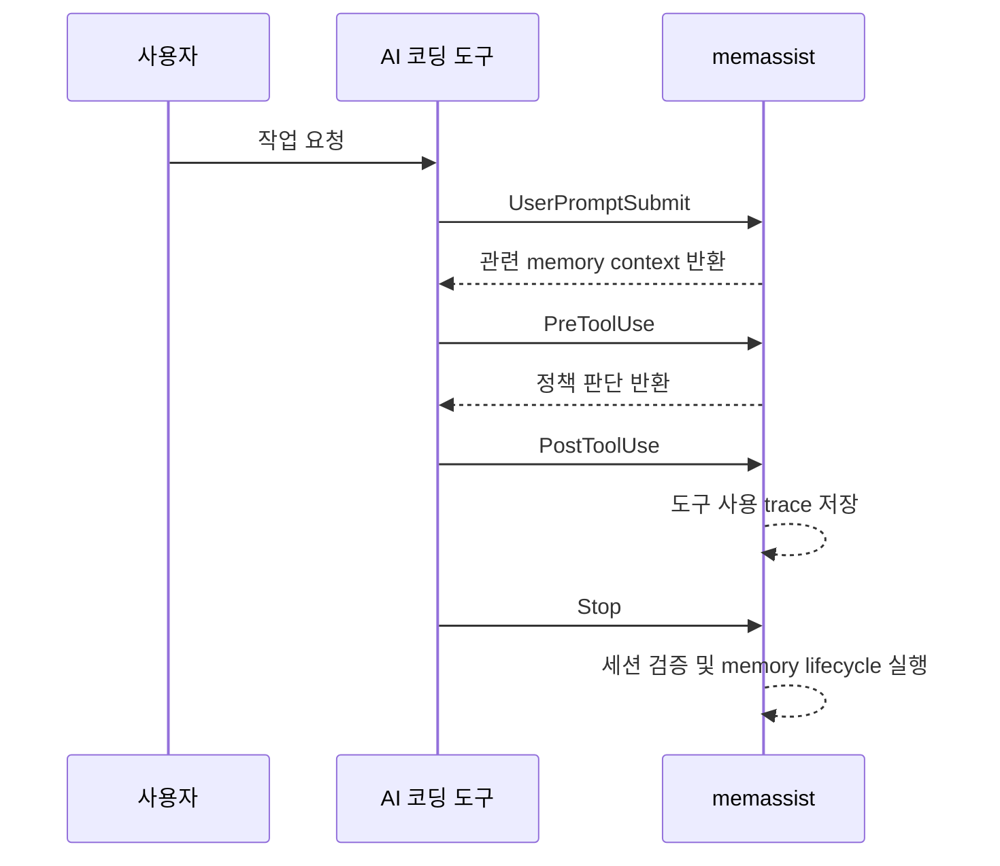
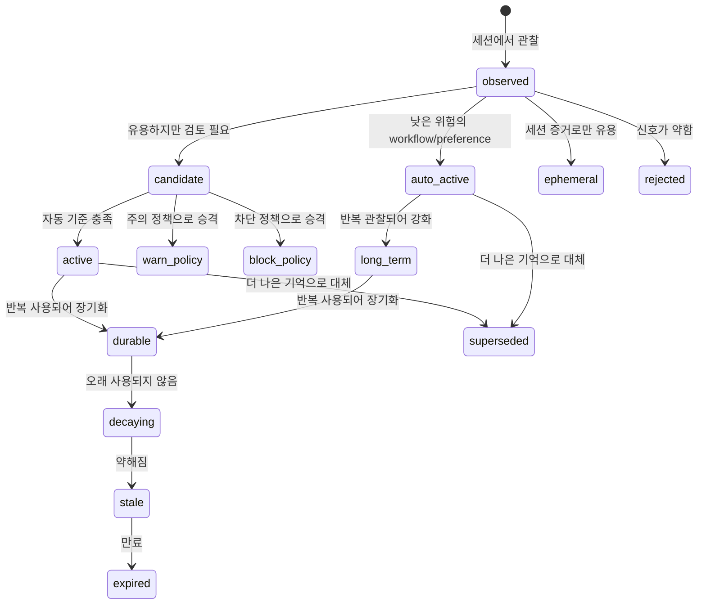
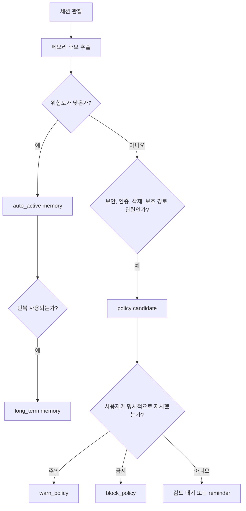
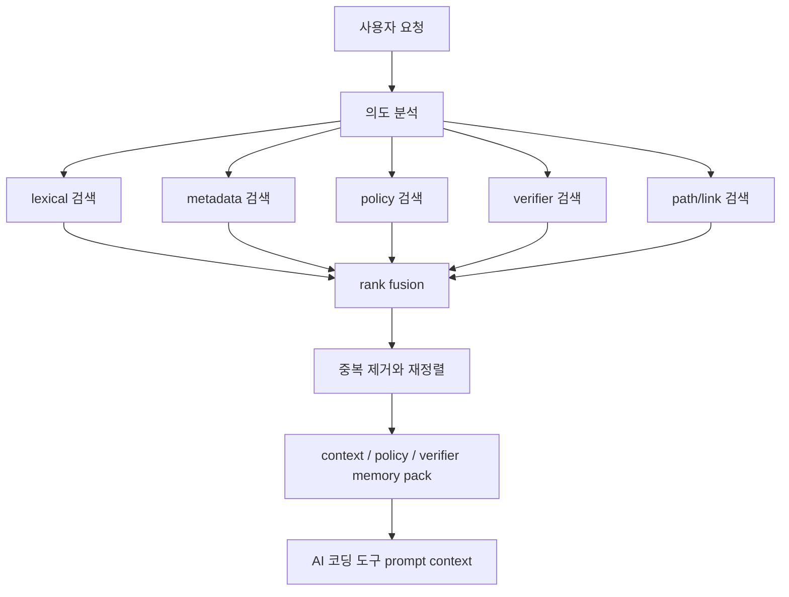
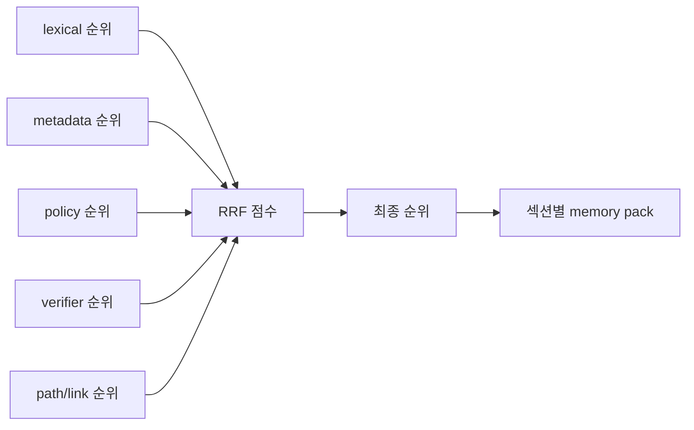
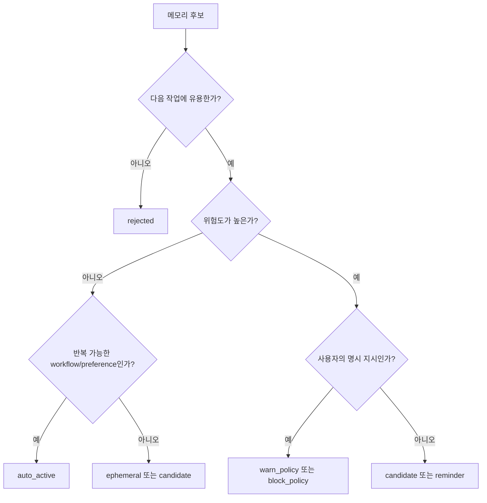
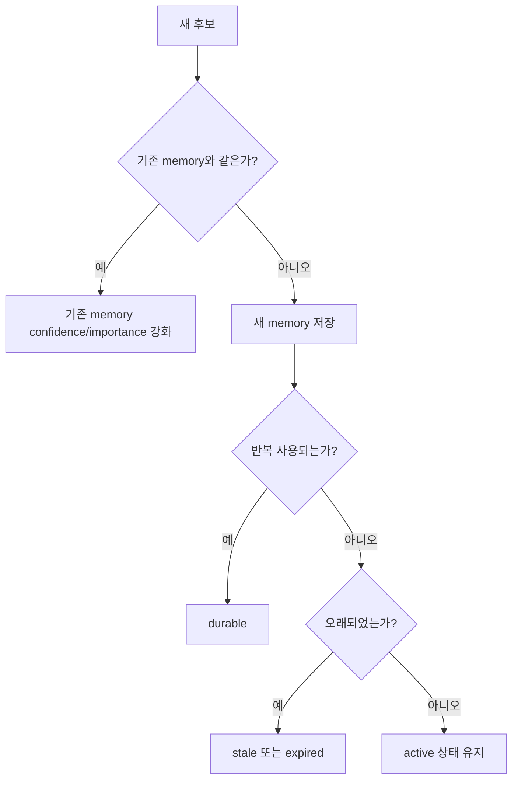

# memassist

`memassist`는 Codex, Claude Code, OpenCode 같은 AI 코딩 도구 옆에서 조용히
작동하는 로컬 메모리 레이어입니다.

사용자는 평소처럼 AI 코딩 도구를 사용합니다. `memassist`는 그 세션을 관찰하면서
프로젝트 규칙, 반복되는 작업 방식, 자주 쓰는 검증 명령, 조심해야 할 파일이나 정책을
기억합니다. 다음 세션에서는 관련 기억을 다시 찾아 AI 코딩 도구의 prompt context에
넣어 줍니다.

핵심 목표는 단순합니다.

> 같은 프로젝트 설명, 같은 테스트 명령, 같은 주의사항을 매번 다시 말하지 않게 한다.

`memassist`는 로컬 우선 도구입니다. 기본 데이터는 `~/.memassist` 아래에 저장되고,
프로젝트별 설정은 프로젝트 루트의 `.memassist/`에 저장됩니다.

> 현재 상태: 초기 로컬 도구입니다. CLI와 저장 구조는 사용할 수 있지만, 위험도가 높은
> 프로젝트에서는 생성된 메모리와 정책 변경을 직접 확인한 뒤 신뢰하는 것이 좋습니다.

## 설치 방법

이 저장소에서 바로 설치합니다.

```bash
python3 -m pip install -e .
```

개발 중에는 설치하지 않고 `PYTHONPATH=src`로 실행할 수도 있습니다.

```bash
PYTHONPATH=src python3 -m memassist status
```

프로젝트에서 처음 사용할 때는 프로젝트 루트에서 초기화합니다.

```bash
memassist init
memassist status
```

AI 코딩 도구와 연결하려면 integration을 함께 설치합니다.

```bash
memassist init --tools codex
memassist init --tools codex,claude,opencode
memassist init --tools all
```

설치 범위를 나눌 수도 있습니다.

| Mode | 동작 |
| --- | --- |
| `full` | 메모리 context 주입, 정책 guard, trace 기록, lifecycle 처리를 모두 사용합니다. |
| `context` | 다음 prompt에 관련 메모리만 주입합니다. |
| `trace` | 세션과 도구 사용 trace만 기록합니다. |
| `guard` | 도구 실행 전 정책 검사만 수행합니다. |

```bash
memassist init --tools codex --mode full
memassist init --tools codex --mode context
```

설치 상태는 언제든지 확인할 수 있습니다.

```bash
memassist doctor
memassist doctor --json
```

도구별 project integration 위치는 다음과 같습니다.

| 도구 | 설정 위치 |
| --- | --- |
| Codex | `.codex/hooks.json` |
| Claude Code | `.claude/settings.json` |
| OpenCode | `.opencode/plugins/memassist.js` |

Codex는 hook 신뢰 설정이 필요합니다. Codex integration을 설치하거나 변경한 뒤에는
Codex CLI에서 `/hooks`를 열고 프로젝트 `.codex` layer와 hook 정의를 신뢰해야 합니다.

## 설치하면 무엇이 자동으로 되나요?

`memassist`는 사용자가 별도 명령을 계속 입력하지 않아도 세션 뒤에서 자동으로
동작하도록 설계되어 있습니다.

- AI 코딩 도구의 세션 이벤트를 trace로 기록합니다.
- 완료된 세션에서 메모리 후보를 추출합니다.
- 낮은 위험의 workflow, preference, 검증 습관은 자동 활성화합니다.
- 반복적으로 확인된 좋은 기억은 장기 메모리로 승격합니다.
- 보안, 인증, 삭제, 보호 경로처럼 위험한 내용은 더 보수적으로 다룹니다.
- 사용자가 일반 대화 속에서 직접 지시한 보호 규칙은 프로젝트 정책으로 승격할 수 있습니다.
- 다음 요청에는 관련 기억을 `context`, `policy`, `verifier`로 나눠 주입합니다.

중요한 원칙이 있습니다.

> 사용자가 몰라도 기억은 쌓이지만, 추론만으로 강한 제약을 함부로 만들지는 않는다.

예를 들어 “앞으로 refresh token 정책을 바꿀 때는 먼저 물어봐”처럼 사용자가 직접 말한
내용은 정책화할 수 있습니다. 반면 세션에서 위험해 보이는 패턴을 추론한 경우에는 바로
차단 정책으로 만들기보다 후보나 reminder로 남깁니다.

## memassist의 작동 흐름

전체 흐름은 observe, extract, evaluate, retrieve 네 단계로 볼 수 있습니다.

```mermaid
flowchart LR
    A[사용자가 AI 코딩 도구에 요청] --> B[도구 integration hook 실행]
    B --> C[UserPromptSubmit / PreToolUse / PostToolUse / Stop 이벤트 기록]
    C --> D[세션 trace 저장]
    D --> E[세션 종료 시 메모리 후보 추출]
    E --> F[유용성, 위험도, 증거, 반복성 평가]
    F --> G[active / candidate / ephemeral / rejected 분류]
    G --> H[다음 요청에서 관련 메모리 검색]
    H --> I[context / policy / verifier memory pack 생성]
    I --> J[AI 코딩 도구 prompt context에 주입]
```



도구마다 hook 형식은 다르지만, `memassist`는 이를 공통 이벤트로 정규화합니다.



이 구조 덕분에 Codex, Claude Code, OpenCode integration이 서로 달라도 내부의
메모리 추출, 정책 판단, retrieval 로직은 같은 데이터 모델을 사용합니다.

## 메모리 라이프사이클

`memassist`는 모든 관찰을 곧바로 장기 기억으로 만들지 않습니다. 기억은 상태를 거치며
강화되거나, 후보 상태로 남거나, 오래되면 약해지고 정리됩니다.



주요 상태는 다음과 같습니다.

| 상태 | 의미 |
| --- | --- |
| `observed` | 세션 trace에서 어떤 행동이나 신호가 관찰되었습니다. |
| `candidate` | 유용할 수 있지만 아직 활성화하지 않은 후보입니다. |
| `auto_active` | 위험도가 낮아 자동으로 활성화된 기억입니다. |
| `active` | 현재 유효한 활성 기억입니다. |
| `durable` | 반복 관찰되거나 자주 쓰여 장기 기억으로 강화된 상태입니다. |
| `warn_policy` | 작업을 막지 않고 주의 reminder로 주입되는 정책 기억입니다. |
| `block_policy` | 명백히 위험하거나 사용자가 강하게 금지한 동작을 차단하는 정책 기억입니다. |
| `ephemeral` | 장기 규칙이 아니라 세션 증거로만 보관되는 기억입니다. |
| `rejected` | 자동 기준에 맞지 않아 사용하지 않는 기억입니다. |
| `stale` / `expired` | 오래되었거나 만료되어 retrieval에서 멀어지는 기억입니다. |
| `superseded` | 더 새로운 기억으로 대체된 기억입니다. |

최근 세션의 lifecycle 결과는 CLI로 확인할 수 있습니다.

```bash
memassist session latest --json
memassist verify --session latest --json
memassist memory candidates --session latest --json
memassist memory list --all
```

## 정책화는 어떻게 이루어지나요?

정책은 일반 기억보다 강한 효과를 갖습니다. 예를 들어 특정 파일 수정을 주의 reminder로
노출하거나, 위험한 shell 명령을 차단할 수 있습니다.

그래서 `memassist`는 정책화를 두 갈래로 나눕니다.

- 사용자가 직접 말한 보호 규칙은 `warn_policy` 또는 `block_policy`로 승격할 수 있습니다.
- 세션에서 추론된 위험 신호는 곧바로 강제 정책으로 만들지 않고 후보 또는 reminder로 남깁니다.



기본 정책 파일은 `.memassist/policy.yaml`입니다.

```yaml
sensitive_paths:
  - ".env"
  - ".env.*"
  - "*.pem"
  - "*.key"
  - "*secret*"

protected_paths: []

dangerous_commands:
  - "\\brm\\s+-r[f]?\\b"
  - "\\bgit\\s+reset\\s+--hard\\b"
  - "\\bgit\\s+clean\\s+-fd\\b"

verification_commands: []
```

정책 판단은 수동으로도 확인할 수 있습니다.

```bash
memassist policy check --tool shell --command "rm -rf dist"
memassist policy check --tool apply_patch --path src/auth/session.py
```

검토한 memory를 명시적으로 보호 경로 정책으로 승격할 수도 있습니다.

```bash
memassist policy promote <memory-id> --protected-path src/auth/session.py
```

## 메모리 탐색 기법: RAG 방식

`memassist`의 retrieval은 일반 문서 QA용 RAG가 아니라 코딩 agent reminder를 위한
로컬 memory-pack RAG입니다.

새 요청이 들어오면 먼저 요청의 의도를 분석합니다.

- 작업 유형: `bugfix`, `feature`, `refactor`, `test`, `review`, `docs`
- 도메인: `auth`, `security`, `database`, `frontend`, `backend`, `cli`, `tests`
- 위험도: `low`, `medium`, `high`
- 관련 경로: 요청에 등장한 파일 경로 또는 도메인 기반 경로 힌트
- 필요한 섹션: 일반 context, 정책 reminder, 검증 reminder

그 다음 여러 검색 채널을 동시에 사용합니다.



각 채널의 역할은 다릅니다.

| 채널 | 목적 |
| --- | --- |
| `lexical` | 요청 문장과 memory 본문이 직접 맞는지 검색합니다. |
| `metadata` | tag, path, type, status 같은 구조화 정보를 사용합니다. |
| `policy` | 보호, 주의, 차단, 보안 관련 memory를 우선 탐색합니다. |
| `verifier` | 테스트 명령, 검증 방식, 재현 절차를 찾습니다. |
| `links_path` | 같은 파일, 같은 tag, 관련 memory link를 따라 확장합니다. |

검색 결과는 Reciprocal Rank Fusion, 즉 RRF 계열 방식으로 합쳐집니다. 한 채널에서만
높게 나온 기억보다 여러 채널에서 꾸준히 관련성이 확인된 기억이 더 안정적으로 위로
올라옵니다.



최종 memory pack은 하나의 긴 목록이 아니라 세 섹션으로 나뉩니다.

| 섹션 | 역할 |
| --- | --- |
| `context` | 프로젝트 사실, 결정, 선호, 일반 lesson을 담습니다. |
| `policy` | 조심해야 할 규칙, 주의 reminder, 차단 정책을 담습니다. |
| `verifier` | 실행해야 할 테스트, 검증 명령, 확인 절차를 담습니다. |

직접 확인하려면 다음 명령을 사용합니다.

```bash
memassist memory pack "login session bug"
memassist memory pack "login session bug" --json
```

## 메모리 평가와 판단 기준

`memassist`는 기억할지 말지를 다음 기준으로 판단합니다.

| 기준 | 설명 | 결과에 주는 영향 |
| --- | --- | --- |
| 유용성 | 다음 작업에서 다시 쓸 가능성이 있는가 | 높으면 memory 후보가 됩니다. |
| 반복성 | 여러 세션에서 반복되는가 | 높으면 `long_term` 승격 가능성이 커집니다. |
| 명시성 | 사용자가 직접 지시했는가 | 정책 승격 가능성이 커집니다. |
| 위험도 | 보안, 인증, 삭제, 배포, 정책 변경과 관련되는가 | 높으면 자동 활성화를 제한합니다. |
| 증거성 | trace, 파일 변경, 명령 실행, 응답 근거가 있는가 | confidence 판단에 사용합니다. |
| 최신성 | 오래되었거나 더 이상 맞지 않는가 | `stale`, `expired`, `superseded` 판단에 사용합니다. |
| 범위 | 전역 기억인지, 프로젝트 기억인지, 세션 한정 정보인지 | memory scope를 결정합니다. |

대략적인 분류 원리는 다음과 같습니다.



같은 기억이 반복되면 새로 중복 저장하기보다 기존 기억을 강화합니다. 오래된 기억은
정리 대상이 되고, 더 나은 기억이 생기면 이전 기억은 `superseded`가 될 수 있습니다.



## 평가 명령

retrieval 품질은 fixture 기반으로 확인할 수 있습니다.

```bash
memassist eval retrieval \
  --query "session timeout npm verification" \
  --expect "npm test" \
  --forbid "refresh token" \
  --json
```

retrieval 평가는 다음 지표를 봅니다.

- `recall_at_k`: 기대한 memory가 상위 결과에 들어왔는지
- `precision_at_k`: 가져온 결과 중 실제로 관련 있는 비율
- `mrr`: 첫 번째 정답이 얼마나 빨리 나오는지
- `forbidden_recall_rate`: 나오면 안 되는 기억이 검색되는 비율

memory 품질 평가는 잘못된 승격과 오래된 기억을 함께 봅니다.

```bash
memassist eval memory \
  --query "session timeout npm verification" \
  --expect "npm test" \
  --forbid "refresh token" \
  --json
```

주요 지표는 다음과 같습니다.

- `memory_recall`
- `memory_precision`
- `wrong_promotion_rate`
- `wrong_policy_rate`
- `stale_memory_rate`

RAG 평가는 `context`, `policy`, `verifier` 섹션까지 확인합니다.

```bash
memassist eval rag --case-file evals/rag/basic.json --json
```

RAG 평가 지표는 다음과 같습니다.

- `section_accuracy`: 기대한 memory가 맞는 섹션에 들어갔는지
- `context_relevance`: context 섹션이 충분히 관련 있는지
- `policy_leak_rate`: policy memory가 엉뚱한 섹션으로 새지 않는지
- `verifier_recall`: 검증 명령이나 테스트 workflow를 잘 찾는지
- `pass_rate`: case별 기대 조건과 금지 조건을 만족하는지
- `score`: 위 지표를 합친 종합 점수

기본 fixture는 `evals/` 아래에 있습니다.

```bash
memassist eval retrieval --case-file evals/retrieval/basic.json --json
memassist eval memory --case-file evals/memory_quality/basic.json --json
memassist eval rag --case-file evals/rag/basic.json --json
```

## 자주 쓰는 명령

상태 확인:

```bash
memassist status
memassist doctor
memassist tools status
```

메모리 확인:

```bash
memassist memory list --all
memassist memory search "session timeout"
memassist memory pack "session timeout fix"
memassist memory drafts
```

메모리 수동 관리:

```bash
memassist memory add --type decision --content "Use pnpm for this repo" --tag tooling
memassist memory activate <memory-id>
memassist memory deactivate <memory-id>
memassist memory rollback <memory-id>
memassist memory cleanup
```

세션 검증:

```bash
memassist verify --session latest
memassist eval run --session latest --json
```

저장소 테스트:

```bash
PYTHONPATH=src python3 -m unittest discover -s tests
```

## 저장 위치와 개인정보

- 기본 데이터베이스는 `~/.memassist` 아래에 저장됩니다.
- 프로젝트 설정은 프로젝트 루트의 `.memassist/`에 저장됩니다.
- memory와 trace는 기본적으로 로컬에 남습니다.
- 민감 파일이나 생성물은 `.memassist/ignore`에 추가해 trace-derived memory 후보에서 제외할 수 있습니다.
- 프로젝트 memory는 SQLite 데이터베이스를 공유하지 않고 export/import할 수 있습니다.

```bash
memassist memory export
memassist memory import .memassist/memories.json
```

import된 memory는 기본적으로 draft입니다. 필요하면 `memassist memory activate`로 활성화합니다.

## 현재 한계

- 이 프로젝트는 아직 초기 로컬 도구입니다.
- 추론된 memory와 정책 후보는 고위험 프로젝트에서 반드시 검토해야 합니다.
- 현재 retrieval은 로컬 deterministic RAG에 가깝고, 외부 embedding 서비스나 네트워크 의존성은 없습니다.
- Codex CLI 버전에 따라 project lifecycle hook 동작이 다를 수 있습니다. hook 기반 end-to-end 검증은 interactive CLI에서 확인하는 것이 안전합니다.

## 추가 참고

한국어 기준 문서는 이 README에서 관리합니다. [README.ko.md](README.ko.md)는 같은
문서 기준을 가리키는 짧은 안내 파일입니다.
