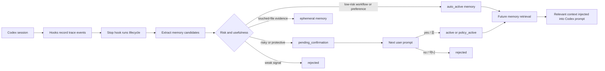
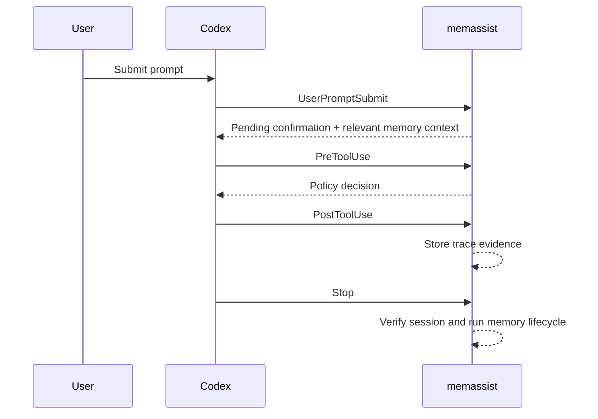
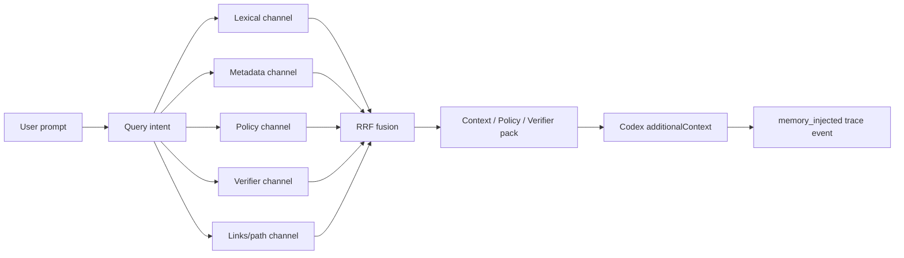
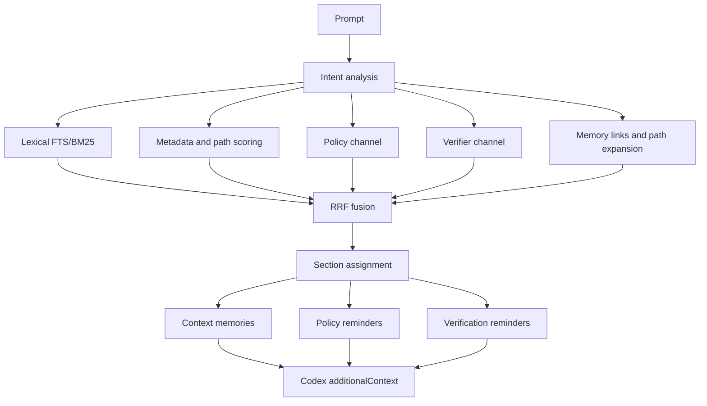
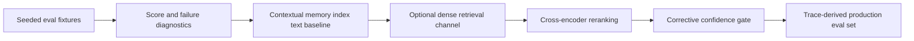

# memassist

`memassist` is a local memory assistant for Codex. It records Codex sessions
through hooks, extracts useful memory candidates, keeps project-scoped memory,
retrieves relevant reminders into future prompts, and can turn approved
protective lessons into project policy.

It is designed for ordinary Codex users who want the assistant to remember
project conventions without pasting the same context into every session.

> Current status: early local tool. The CLI and storage model are usable, but
> you should review generated memories and policy changes before relying on
> them in high-risk projects.

## What It Does

- Records Codex tool activity as local trace events.
- Extracts memory candidates from completed sessions.
- Automatically activates low-risk workflow or preference memories.
- Keeps risky or protective memories pending until the next natural-language
  confirmation.
- Retrieves relevant memories and verification reminders into future Codex
  prompts.
- Blocks dangerous shell commands and asks for approval around protected paths.
- Provides session verification and retrieval evaluation commands.
- Exports and imports project memory without sharing the local SQLite database.

## How It Works



`memassist` stores data under `~/.memassist` by default. Project configuration
lives in `.memassist/` inside the project directory. A git repository is not
required.

## Installation

From this repository:

```bash
python3 -m pip install -e .
```

During local development, you can also run commands without installing by using
`PYTHONPATH=src`:

```bash
PYTHONPATH=src python3 -m memassist status
```

Set `MEMASSIST_HOME` if you want to keep the database somewhere other than
`~/.memassist`:

```bash
export MEMASSIST_HOME="$HOME/.local/share/memassist"
```

## Initialize A Project

Run this from the project where Codex will work:

```bash
memassist init
memassist status
```

`init` creates:

- `.memassist/policy.yaml` for sensitive paths, protected paths, dangerous
  command patterns, and verification commands.
- `.memassist/ignore` for paths that should not be recorded.
- A project record in the local memassist database.

If you want project hooks installed in the same step, opt in explicitly:

```bash
memassist init --hooks
```

Check setup health at any time:

```bash
memassist doctor
memassist doctor --json
```

`doctor` checks project config, local storage, Codex hook installation, Codex CLI
availability, and reminds you that project hooks must still be trusted in Codex
with `/hooks`.

## Install Codex Hooks

Install project-local Codex hooks:

```bash
memassist hooks install codex
memassist hooks status codex
```

Project hooks are written to `.codex/hooks.json`. Use user-wide hooks only when
you intentionally want memassist to run across projects:

```bash
memassist hooks install codex --scope user
```

The installed hooks use these Codex events:



Codex requires hook trust. After installing or changing project hooks, open
`/hooks` in Codex CLI and trust the project `.codex` layer and exact hook
definitions. For automation, Codex also has `--dangerously-bypass-hook-trust`,
but persisted trust is the reliable default for repeated local testing.

## Automatic Memory Lifecycle

The normal path is automatic:

1. Codex runs with hooks enabled.
2. The `Stop` hook records the final session state and runs the lifecycle.
3. `memassist` extracts memory candidates from trace events and the final
   assistant message.
4. Low-risk candidates become active immediately.
5. Risky or protective candidates wait for the next user confirmation.
6. Future prompts receive a small memory pack when the query is relevant.

Current lifecycle statuses include:

| Status | Meaning |
| --- | --- |
| `observed` | A behavior or event was seen in a session trace. |
| `candidate` | The signal may be useful but is not active yet. |
| `auto_active` | A low-risk memory was activated automatically. |
| `long_term` | A repeated high-quality memory was promoted for durable retrieval. |
| `pending_confirmation` | The memory needs a short user approval or rejection. |
| `policy_active` | An approved protective memory was added to project policy and passed simulation. |
| `ephemeral` | Useful trace evidence kept as session context, not a durable rule. |
| `rejected` | The memory was rejected or fell below the automatic threshold. |

Inspect the latest lifecycle state:

```bash
memassist session latest --json
memassist verify --session latest --json
memassist memory candidates --session latest --json
memassist memory list --all
```

## Natural-Language Confirmation

If the user directly gives a memory or policy instruction, memassist treats that
instruction as already approved. For example:

```text
Refresh token changes must ask for my approval before editing.
```

or:

```text
리프레시 토큰 관련 변경은 변경 전에 나의 승인부터 받아야 해.
```

On `UserPromptSubmit`, memassist stores the instruction immediately. If it can
infer a matching project file, it promotes the memory to `policy_active` and
adds the protected path to `.memassist/policy.yaml`. If the path cannot be
inferred, the memory still becomes active so it can be retrieved before related
future work.

When a memory is `pending_confirmation`, the next `UserPromptSubmit` hook shows
the pending item. A short response is enough:

- `yes`, `y`, `ok`, `approve`, `remember`
- `응`, `그래`, `좋아`, `기억해`, `승인`
- `no`, `n`, `reject`, `cancel`
- `아니`, `취소`, `거절`

Approved low-risk pending memories become `active`. Approved protective memories
try to infer a project path from memory text, trace files, or project filenames.
If memassist can add that path to `.memassist/policy.yaml` and the simulated
policy check blocks the edit, the memory becomes `policy_active`.

## Policy Protection

`memassist` ships with a small local policy engine. The default policy warns on
sensitive paths, denies dangerous recursive commands, and lets you add protected
paths that require explicit approval.

Example `.memassist/policy.yaml`:

```yaml
sensitive_paths:
  - ".env"
  - ".env.*"
  - "*.pem"
  - "*.key"
  - "*secret*"

protected_paths:
  - "src/auth/refresh-token-policy.ts"

dangerous_commands:
  - "\\brm\\s+-r[f]?\\b"
  - "\\bgit\\s+reset\\s+--hard\\b"
  - "\\bgit\\s+clean\\s+-fd\\b"

verification_commands: []
```

Check policy decisions manually:

```bash
memassist policy check --tool shell --command "rm -rf dist"
memassist policy check --tool apply_patch --command "*** Update File: src/auth/refresh-token-policy.ts"
```

Promote a reviewed memory into protected-path policy:

```bash
memassist policy promote <memory-id> --protected-path src/auth/refresh-token-policy.ts
```

In Codex hooks, `require_approval` is currently mapped to a deny response with a
reason telling Codex that explicit user approval is required.

## Retrieval And Evaluation

Build a memory pack for a new prompt:

```bash
memassist memory pack "login session bug"
```

The pack separates memories into:

- `context`: relevant facts, lessons, decisions, and preferences.
- `policy`: rules or memories with warning, approval, or blocking enforcement.
- `verifier`: workflow memories such as test commands.

RAG retrieval is intent-aware and section-aware:



The deterministic intent analyzer extracts task type, domains, likely paths,
risk level, policy need, verifier need, and derived retrieval queries. Retrieval
then combines lexical, metadata, policy, verifier, and memory-link/path channels
with RRF-style rank fusion. No embedding service or network dependency is
required.

The current implementation is a local memory-pack RAG system, not a general
document QA system. It is optimized for coding-agent reminders:



The quality target for this repository is a `memassist eval rag` score of 4.5
or higher on seeded, repeatable fixtures. The score is a 5-point weighted
summary:

- `section_accuracy`: expected memories appear in the expected pack section.
- `context_relevance`: expected hits are dense relative to retrieved pack size.
- `policy_leak_rate`: forbidden policy leakage remains zero.
- `verifier_recall`: expected verification workflows are retrieved.
- `pass_rate`: each case satisfies expected and forbidden terms.

Evaluate retrieval quality with expected and forbidden terms:

```bash
memassist eval retrieval \
  --query "session timeout npm verification" \
  --expect "npm test" \
  --forbid "refresh token" \
  --json
```

Retrieval evaluation reports:

- `recall_at_k`
- `precision_at_k`
- `mrr`
- `forbidden_recall_rate`

Use this before depending on automatic memory injection in a project where noisy
or stale memories could mislead Codex.

Evaluate broader memory quality:

```bash
memassist eval memory \
  --query "session timeout npm verification" \
  --expect "npm test" \
  --forbid "refresh token" \
  --json
```

Memory quality evaluation reports:

- `memory_recall`
- `memory_precision`
- `wrong_promotion_rate`
- `wrong_policy_rate`
- `stale_memory_rate`

Example fixture files live under `evals/`:

```bash
memassist eval retrieval --case-file evals/retrieval/basic.json --json
memassist eval memory --case-file evals/memory_quality/basic.json --json
memassist eval rag --case-file evals/rag/basic.json --json
```

RAG evaluation is section-aware. It checks whether expected terms appear in the
right pack section and reports:

- `section_accuracy`
- `context_relevance`
- `policy_leak_rate`
- `verifier_recall`
- `pass_rate`
- `score`

RAG fixture cases may include a `seed` list. These memories are inserted only
for that case and removed before the command exits, so fixture evaluation works
even when the current project has no active memories:

```json
{
  "query": "change session timeout and verify",
  "seed": [
    {
      "section": "context",
      "content": "Session timeout fixes should update the session timeout behavior only.",
      "tags": ["auth", "session", "timeout"],
      "paths": ["src/auth/session.py"]
    },
    {
      "section": "verifier",
      "content": "Run npm test -- auth session after session timeout changes.",
      "tags": ["verification", "test", "auth", "session"]
    }
  ],
  "expect": [
    { "term": "session timeout", "section": "context" },
    { "term": "npm test", "section": "verifier" }
  ],
  "forbid": [
    { "term": "refresh token", "section": "context" }
  ]
}
```

The repository fixture currently passes the target:

```bash
PYTHONPATH=src python3 -m memassist eval rag --case-file evals/rag/basic.json --json
```

Expected headline result:

```json
{
  "passed": true,
  "score": 4.833
}
```

## RAG Improvement Roadmap

The next quality steps are intentionally staged so each can be verified with
fixture evals before it changes prompt injection behavior:



The planned 4.5+ architecture keeps the current local-first behavior, then adds
optional layers:

- Contextual memory text: index memory content together with section, path,
  status, enforcement, tags, and reason so short memories do not lose meaning.
  A SQLite FTS baseline is implemented.
- Hybrid retrieval: combine sparse BM25 with optional dense embeddings through
  rank fusion.
- Reranking: re-score top retrieval candidates before section assignment.
- Corrective gate: suppress or shrink memory packs when retrieval confidence is
  low or memories conflict.
- Production eval slices: promote real trace failures into repeatable cases.

## Verification And Testing

Verify a traced session:

```bash
memassist verify --session latest
memassist eval run --session latest --json
```

Verification checks trace evidence against visible memories and project policy.
For example, it can flag a session that touched code without an observed test
command, while treating policy-denied protected edits as expected blocks.

Run one maintenance pass manually:

```bash
memassist daemon once --session latest --json
```

This processes memory candidates, expires old memories, and runs lightweight
evaluation checks. In normal Codex usage, the `Stop` hook invokes the same
lifecycle automatically.

Run the repository tests:

```bash
PYTHONPATH=src python3 -m unittest discover -s tests
```

## Manual Memory Commands

Manual commands are useful for debugging, reviewing, and bootstrapping:

```bash
memassist memory add --type decision --content "Use pnpm for this repo" --tag tooling
memassist memory search "pnpm"
memassist memory list --all
memassist memory review
memassist memory approve <memory-id>
memassist memory reject <memory-id>
memassist memory rollback <memory-id>
memassist memory links <memory-id>
memassist memory cleanup
```

`rollback` rejects a memory and removes its protected path when the memory or
command supplies one. Use it to undo an incorrect `policy_active` promotion.
`links` shows related memories created from shared tags, paths, and content
terms. This is the first lightweight memory-evolution layer; future scoring can
use these links to explain why a memory was retrieved or why an older memory was
superseded.

Export and import project memory:

```bash
memassist memory export
memassist memory import .memassist/memories.json
```

Imported memories are drafts by default. Review and approve them before they
become active context.

## Known Codex CLI Caveat

End-to-end local testing confirmed that interactive Codex CLI sessions can run
the installed lifecycle hooks when the hook definitions are trusted or hook trust
is bypassed.

In Codex CLI `0.136.0`, `codex exec` did not run project lifecycle hooks in
local testing. Use the interactive CLI for hook-based E2E validation until that
behavior is verified in your installed Codex version.

## Storage And Privacy

- Memory and traces are local by default.
- The default database path is under `~/.memassist`.
- Project policy and ignore files live under `.memassist/`.
- Exported memories can be shared as `.memassist/memories.json`; the local
  SQLite database does not need to be shared.
- Add sensitive files or generated directories to `.memassist/ignore` when they
  should not appear in trace-derived memory candidates.

## Korean README

A Korean version is available at [README.ko.md](README.ko.md).

## References

- RAGAS: Automated Evaluation of Retrieval Augmented Generation:
  https://arxiv.org/abs/2309.15217
- RAGAS metrics documentation:
  https://docs.ragas.io/en/v0.3.1/concepts/metrics/available_metrics/
- TruLens RAG Triad:
  https://www.trulens.org/getting_started/core_concepts/rag_triad/
- Anthropic Contextual Retrieval:
  https://www.anthropic.com/engineering/contextual-retrieval
- Corrective Retrieval Augmented Generation:
  https://arxiv.org/abs/2401.15884
- Self-RAG:
  https://arxiv.org/abs/2310.11511
- BGE reranker documentation:
  https://bge-model.com/Introduction/reranker.html
- ColBERTv2:
  https://arxiv.org/abs/2112.01488
- RAPTOR:
  https://arxiv.org/abs/2401.18059
- Microsoft GraphRAG:
  https://microsoft.github.io/graphrag//index/overview/
