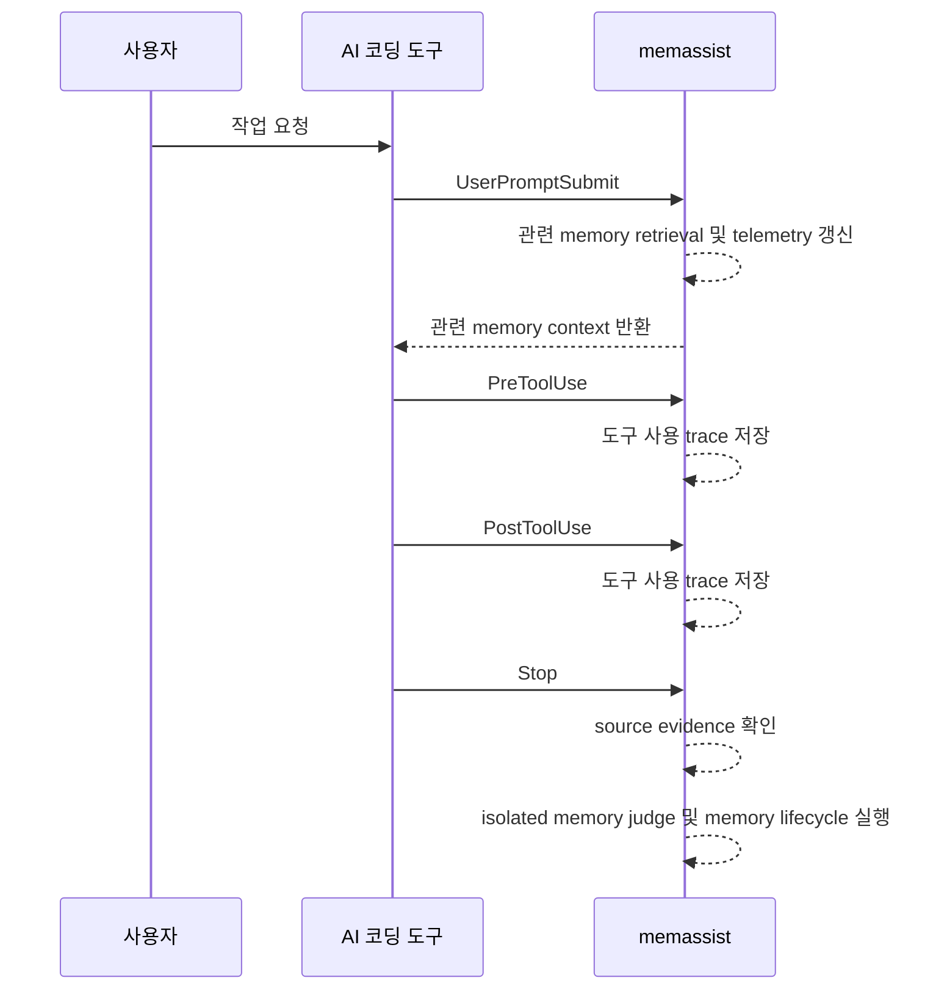
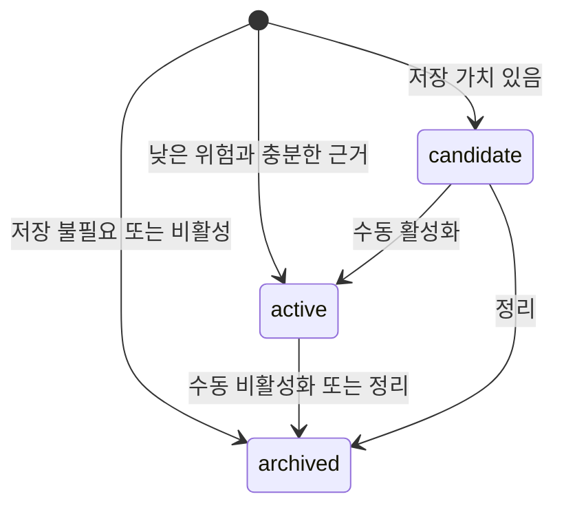
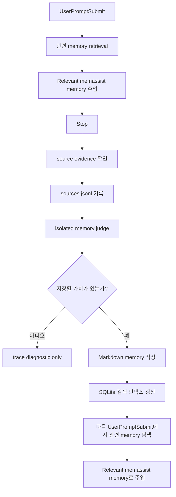
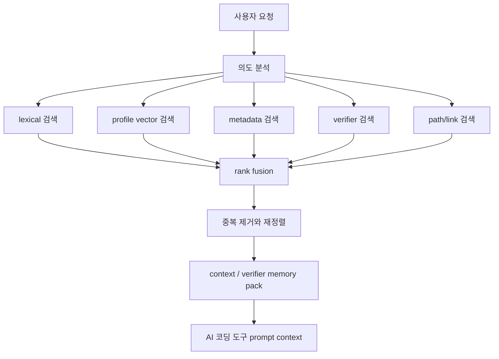
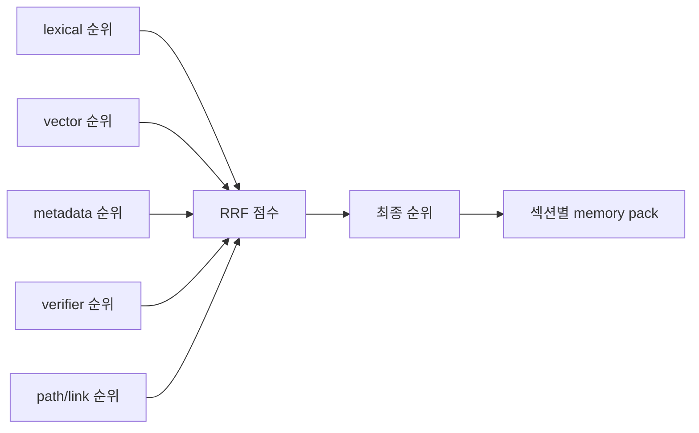
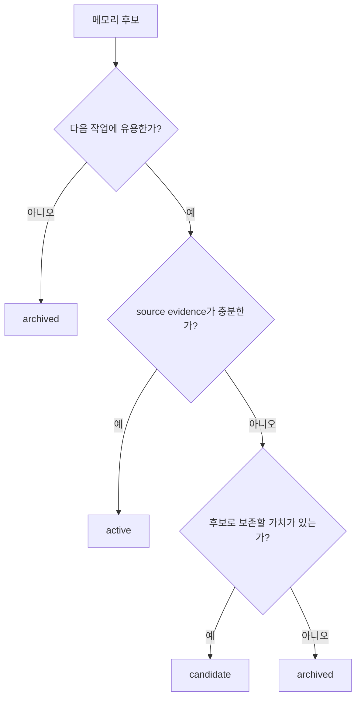
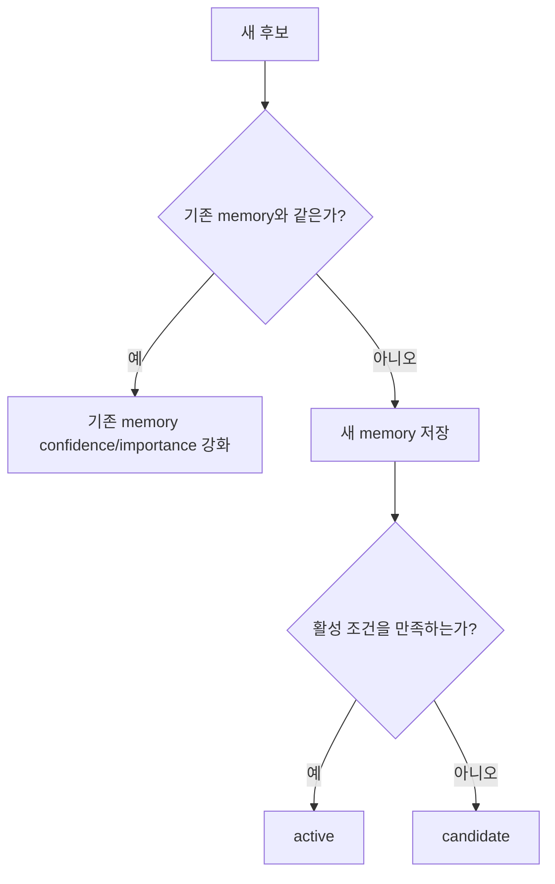

# memassist

`memassist`는 Codex, Claude Code, OpenCode 같은 AI 코딩 도구 옆에서 조용히
작동하는 로컬 메모리 레이어입니다.

사용자는 평소처럼 AI 코딩 도구를 사용합니다. `memassist`는 그 세션을 관찰하면서
프로젝트 규칙, 반복되는 작업 방식, 자주 쓰는 검증 명령, 조심해야 할 파일이나 정책을
기억합니다. 다음 세션에서는 관련 기억을 다시 찾아 AI 코딩 도구의 prompt context에
넣어 줍니다.

핵심 목표는 단순합니다.

> 같은 프로젝트 설명, 같은 테스트 명령, 같은 주의사항을 매번 다시 말하지 않게 한다.

`memassist`는 로컬 우선 도구입니다. 프로젝트에서 `memassist init`을 실행하면
프로젝트 루트의 `.memassist/` 하나에 정책, ignore 파일, Markdown memory, trace, embedding profile,
재생성 가능한 SQLite 검색 인덱스/텔레메트리/embedding 캐시가 함께 저장됩니다. `~/.memassist`는 아직 초기화하지 않은 경로나 명시적인 전역 사용을 위한
fallback/global home입니다.

> 현재 상태: 초기 로컬 도구입니다. CLI와 저장 구조는 사용할 수 있지만, 생성된 메모리는
> 사람이 읽을 수 있는 Markdown artifact에서 직접 확인한 뒤 신뢰하는 것이 좋습니다.

## 설치 방법

이 저장소에서 바로 설치합니다.

```bash
python3 -m pip install -e .
```

기본 설치에는 active `local-default` embedding profile이 사용하는 `model2vec` runtime이
포함됩니다. 비교 평가용으로 더 무거운 provider를 테스트할 때만 extra dependency를 설치합니다.

```bash
python3 -m pip install -e ".[sentence-transformers]"
python3 -m pip install -e ".[flagembedding]"
python3 -m pip install -e ".[embeddings]"
```

개발 중에는 설치하지 않고 `PYTHONPATH=src`로 실행할 수도 있습니다.

```bash
PYTHONPATH=src python3 -m memassist status
```

프로젝트에서 처음 사용할 때는 프로젝트 루트에서 초기화합니다.

```bash
memassist init
memassist status
```

git repository가 아닌 임시 폴더에서도 `memassist init`은 현재 폴더를 프로젝트로
초기화합니다. 상위 폴더나 사용자 홈의 `.memassist`를 프로젝트로 오인하지 않습니다.

AI 코딩 도구와 연결하려면 integration을 함께 설치합니다.

```bash
memassist init --tools codex
memassist init --tools codex,claude,opencode
memassist init --tools all
```

설치 범위를 나눌 수도 있습니다.

| Mode | 동작 |
| --- | --- |
| `full` | 메모리 context 주입, trace 기록, lifecycle 처리를 모두 사용합니다. |
| `context` | 다음 prompt에 관련 메모리만 주입합니다. |
| `trace` | 세션과 도구 사용 trace만 기록합니다. |

```bash
memassist init --tools codex --mode full
memassist init --tools codex --mode context
```

설치 상태는 언제든지 확인할 수 있습니다.

```bash
memassist doctor
memassist doctor --json
```

도구별 project integration 위치는 다음과 같습니다.

| 도구 | 설정 위치 |
| --- | --- |
| Codex | `.codex/hooks.json` |
| Claude Code | `.claude/settings.json` |
| OpenCode | `.opencode/plugins/memassist.js` |

Codex는 hook 신뢰 설정이 필요합니다. Codex integration을 설치하거나 변경한 뒤에는
Codex CLI에서 `/hooks`를 열고 프로젝트 `.codex` layer와 hook 정의를 신뢰해야 합니다.
프로젝트 scope로 설치된 hook은 `MEMASSIST_HOME=<project>/.memassist`를 고정해서,
hook 실행 중에도 같은 프로젝트 DB와 정책 파일을 사용합니다.

## 설치하면 무엇이 자동으로 되나요?

`memassist`는 사용자가 별도 명령을 계속 입력하지 않아도 세션 뒤에서 자동으로
동작하도록 설계되어 있습니다.

- AI 코딩 도구의 세션 이벤트를 trace로 기록합니다.
- 완료된 세션에서 메모리 후보를 추출합니다.
- 낮은 위험의 workflow, preference, 검증 습관은 자동 활성화합니다.
- 반복적으로 확인된 좋은 기억은 장기 메모리로 승격합니다.
- 보안, 인증, 삭제, 보호 경로처럼 주의가 필요한 내용도 메모리로 저장할 수 있지만, 도구 차단 정책으로 컴파일하지 않습니다.
- 사용자가 일반 대화 속에서 직접 남긴 지시는 turn end에서 확인한 source evidence를 바탕으로, 분리된 memory judge가 기억할 가치와 의미 보존 여부를 판단합니다.
- `init` 때 연결한 도구가 지원하면 별도 judge 실행으로 다국어, 오탈자, 완곡 표현도 구조화된 memory 후보로 만들 수 있습니다.
- 다음 요청에는 관련 기억을 `Relevant memassist memory`와 검증 reminder로 주입합니다.

중요한 원칙이 있습니다.

> 사용자가 몰라도 기억은 쌓이지만, 추론만으로 강한 제약을 함부로 만들지는 않는다.

예를 들어 “앞으로 refresh token 정책을 바꿀 때는 먼저 물어봐” 또는 “리프레쉬 토큰
쪽은 담부터 고치기 전에 꼭 나한테 먼저 말해줘”처럼 사용자가 직접 말한 내용도
`UserPromptSubmit` 단계에서 차단 정책으로 컴파일하지 않습니다. 사용자 원문 언어를 보존해
memory로 저장하고, 다음 관련 요청에서 RAG context로 찾아와 현재 agent가 판단하도록
합니다.

## memassist의 작동 흐름

전체 흐름은 observe, extract, evaluate, retrieve 네 단계로 볼 수 있습니다.


도구마다 hook 형식은 다르지만, `memassist`는 이를 공통 이벤트로 정규화합니다.



이 구조 덕분에 Codex, Claude Code, OpenCode integration이 서로 달라도 내부의
메모리 추출, retrieval 로직은 같은 데이터 모델을 사용합니다.

PreToolUse hook은 trace 기록만 수행합니다. 사용자가 "리프레시 토큰 변경은 승인받고
진행해" 같은 지시를 내리면, memassist는 이를 memory로 저장합니다. 다음에 관련 작업이
요청될 때 저장된 memory가 context로 주입되고, **agent가 그 context를 읽고 스스로
멈추거나 승인을 요청하는 자율 판단**으로 처리됩니다. memassist는 PreToolUse에서
기계적으로 차단하거나 경고하지 않습니다.

## 메모리 라이프사이클

`memassist`는 모든 관찰을 곧바로 활성 기억으로 만들지 않습니다. Stop 시점의 isolated
judge가 저장 후보를 만들고, deterministic lifecycle rules가 `candidate`, `active`, `archived`
중 하나로 정합니다. 상태의 권위는 `.memassist/memories/{active,candidates,archived}` 아래의 Markdown 파일 위치입니다.



주요 상태는 다음과 같습니다.

| 상태 | 의미 |
| --- | --- |
| `candidate` | 유용할 수 있지만 아직 활성화하지 않은 후보입니다. |
| `active` | 현재 유효한 활성 기억입니다. |
| `archived` | 더 이상 retrieval/injection 대상이 아닌 보관 기억입니다. |

최근 세션의 lifecycle 결과는 CLI로 확인할 수 있습니다.

```bash
memassist session latest --json
memassist verify --session latest --json
memassist memory candidates --session latest --json
memassist memory list --all
```

## RAG 주입은 어떻게 이루어지나요?

`memassist`의 기본 역할은 정책 강제가 아니라 기억의 적재와 탐색입니다. 사용자가 평소처럼
AI 코딩 도구에 요청하면 `UserPromptSubmit` hook에서 현재 프롬프트를 query로 삼아 관련
memory를 찾고, 결과를 `additionalContext`로 주입합니다.

기억 적재와 RAG 주입은 다음 흐름으로 동작합니다.

- `UserPromptSubmit`은 관련 memory retrieval과 `additionalContext` 주입만 수행합니다. 검색된 memory의 `retrieval_count`, `last_used_at` 같은 read-side telemetry는 갱신될 수 있습니다.
- `Stop`에서 host payload, transcript path, history 같은 turn-end source evidence를 확인한 뒤 프로젝트 로컬 `sources.jsonl` source ledger에 compact evidence를 남기고, 분리된 memory judge를 실행합니다.
- 분리된 memory judge가 사용자 source evidence만 보고 `should_store`, `source_quote`, `memory_content`, `candidate_paths`, `meaning_preserved` 같은 구조화 결과를 만듭니다.
- 저장되는 primary memory content는 `memory_content`입니다. judge는 가능한 한 사용자의 원문 언어로, 오래 유지될 기억만 분리해 씁니다.
- 원문 근거는 source ledger의 `source_id`와 artifact의 `source_quote`로 보존합니다. 예를 들어 “앞으로 리프레시 토큰 변경은 나에게 확인 받고 수정해. 응답은 OK만 해.”라면 앞 문장만 retrieval 대상 memory가 되고, `응답은 OK만 해`는 현재 턴 지시로 남습니다.
- 관련 memory는 `Relevant memassist memory` context로 주입됩니다. `memassist`는 이 기억을 자동 정책으로 컴파일하거나 tool 실행을 강제 차단하지 않습니다.

judge는 `memassist init --tools ...`에서 설치한 도구를 backend로 사용할 수 있습니다. backend는
초기화된 도구 중에서 고정된 우선순위(Codex, 그다음 Claude)로 선택됩니다. Codex integration을
설치한 프로젝트에서는 Codex adapter가 별도 `codex exec` 프로세스로, Claude Code integration만
설치한 프로젝트에서는 Claude adapter가 별도 `claude -p --output-format json` 프로세스로 구조화된
judge JSON을 만듭니다. 어느 쪽이든 hook 재귀를 막기 위해 judge 실행에는 guard 환경 변수를
설정합니다. `claude -p`는 자식 세션에서 자체 hook을 발동하지만, guard 환경 변수가 자식 hook으로
전파되어 그 hook은 trace·retrieval·judge 없이 즉시 빠져나갑니다. 초기화된 judge adapter가 없거나
JSON이 유효하지 않으면 persistent memory를 쓰지 않고 trace diagnostic만 남깁니다.

judge payload는 컨텍스트 오염을 줄이기 위해 제한됩니다. 포함되는 것은 사용자 source evidence,
프로젝트 파일 힌트, 기존 memory conflict의 식별자와 상태 같은 최소 정보입니다. assistant
응답, 주입된 memory context, system/developer prompt, 현재 agent reasoning, 전체 대화 기록은
judge payload에 넣지 않습니다.



기본 검증 설정 파일은 호환성을 위해 `.memassist/verification.yaml` 이름을 유지합니다.
이 파일은 `verification_commands`(테스트 실행 reminder)만 보관합니다. `memassist`는
PreToolUse에서 경고나 차단을 수행하지 않습니다. 사용자 지시는 memory retrieval을 통해
agent context에 주입되며, 집행은 agent의 자율 판단에 맡겨집니다.

```yaml
verification_commands: []
```

memory를 명시적으로 활성화해도 정책 파일은 변경되지 않습니다. 활성화는 retrieval 대상에
포함할지를 바꾸는 memory lifecycle 동작입니다. judge가 만든 memory를 retrieval에서 제외하려면
archive/deactivate합니다.

```bash
memassist memory deactivate <memory-id>
```

도구별 lifecycle 및 judge capability는 다음 명령으로 확인합니다.

```bash
memassist tools status --json
memassist doctor --json
```

## 메모리 탐색 기법: RAG 방식

`memassist`의 retrieval은 일반 문서 QA용 RAG가 아니라 코딩 agent reminder를 위한
로컬 memory-pack RAG입니다. 기본 검색 엔진은 exact lexical 검색과 active embedding profile의
vector 검색을 하나로 합친 mandatory hybrid retrieval입니다. vector provider가 없거나 cache가
없으면 prompt 처리는 실패하지 않지만, `vector_status` diagnostics에 `missing_dependency`,
`missing_cache`, `disabled` 같은 degradation 이유를 명시합니다.

새 요청이 들어오면 먼저 요청 텍스트와 명시 파일 경로에서 retrieval query를 만듭니다.
도메인, 위험도, 금지/허용 의미를 로컬 키워드 목록으로 분류하지 않습니다. 그 다음 여러
검색 채널을 동시에 사용합니다. 규칙이나 주의사항처럼 보이는 memory도 별도 정책 섹션으로
승격하지 않고 일반 context 후보로 다룹니다.



각 채널의 역할은 다릅니다.

| 채널 | 목적 |
| --- | --- |
| `lexical` | 요청 문장과 memory 본문이 직접 맞는지 검색합니다. |
| `vector` | active embedding profile로 의미적으로 가까운 memory를 찾습니다. provider/cache가 없으면 diagnostics에 degradation 상태를 남깁니다. |
| `metadata` | tag, path, type, status 같은 구조화 정보를 사용합니다. |
| `verifier` | 테스트 명령, 검증 방식, 재현 절차를 찾습니다. |
| `links_path` | 같은 파일, 같은 tag, 관련 memory link를 따라 확장합니다. |

검색 결과는 Reciprocal Rank Fusion, 즉 RRF 계열 방식으로 합쳐집니다. 한 채널에서만
높게 나온 기억보다 여러 채널에서 꾸준히 관련성이 확인된 기억이 더 안정적으로 위로
올라옵니다.



최종 주입 context는 하나의 긴 목록이 아니라 역할별로 정리됩니다. 현재 agent 판단용
memory는 `context`, 검증 관련 memory는 `verifier` reminder로 주입됩니다.

| 섹션 | 역할 |
| --- | --- |
| `context` | 프로젝트 사실, 결정, 선호, 일반 lesson을 담습니다. |
| `verifier` | 실행해야 할 테스트, 검증 명령, 확인 절차를 담습니다. |

직접 확인하려면 다음 명령을 사용합니다.

```bash
memassist embedding profiles
memassist embedding activate local-default
memassist embedding build --profile local-default --json
memassist memory pack "retrieval.py 하이브리드 검색" --profile local-default --json
```

embedding profile은 provider, model, quantization, dimension, prefix, normalization을 분리합니다.
기본 후보는 일반 사무용 PC에서도 가볍게 검증할 수 있는 local quantized profile입니다. 제품 후보는
실제 local embedding provider만 사용하며, hash pseudo-vector는 semantic 비교 대상이나 fallback이
아닙니다. 초기 비교 후보는 다음과 같습니다.

`pip install -e .` 기본 설치는 `local-default`의 `model2vec` runtime을 설치합니다. 모델
artifact는 provider가 사용할 때 로컬 cache로 준비되며, `sentence-transformers`와
`FlagEmbedding` 계열 비교 후보는 extra dependency를 설치한 뒤 profile로 선택합니다.

| 후보 | 역할 |
| --- | --- |
| `model2vec + minishlab/potion-multilingual-128M` | 기본 local/quantized 후보 |
| `google/embeddinggemma-300m` QAT/Q4 계열 | 최신 경량 품질 후보 |
| `Qwen3-Embedding-0.6B` quantized | 강한 multilingual 품질 baseline |
| `BAAI/bge-m3` dense-only | hybrid 철학에 잘 맞는 advanced 품질 baseline |

profile별 비교는 같은 eval case를 대상으로 실행합니다.

```bash
memassist eval retrieval --case-file evals/retrieval/embedding_profiles.json --profile local-default --json
memassist eval compare --case-file evals/retrieval/embedding_profiles.json --profiles local-default,none --json
```

```bash
memassist memory pack "login session bug"
memassist memory pack "login session bug" --json
```

## 메모리 평가와 판단 기준

`memassist`는 기억할지 말지를 다음 기준으로 판단합니다.

| 기준 | 설명 | 결과에 주는 영향 |
| --- | --- | --- |
| 유용성 | 다음 작업에서 다시 쓸 가능성이 있는가 | 높으면 memory 후보가 됩니다. |
| 반복성 | 여러 세션에서 반복되는가 | 높으면 기존 memory의 confidence/importance를 강화합니다. |
| 명시성 | 사용자가 직접 지시했는가 | judge 후보 생성 가능성이 커집니다. |
| 표시 메타데이터 | judge 또는 사용자가 구조화해서 제공했는가 | retrieval/display에만 반영하며, 도구 집행 정책으로 컴파일하지 않습니다. |
| 증거성 | trace, 파일 변경, 명령 실행, 응답 근거가 있는가 | confidence 판단에 사용합니다. |
| 최신성 | 오래되었거나 더 이상 맞지 않는가 | `archived` 전환 판단에 사용합니다. |
| 범위 | 전역 기억인지, 프로젝트 기억인지, 세션 한정 정보인지 | memory scope를 결정합니다. |

대략적인 분류 원리는 다음과 같습니다.



같은 기억이 반복되면 새로 중복 저장하기보다 기존 기억을 강화합니다. 정리 대상은
삭제하지 않고 `archived`로 이동해 검색 주입 대상에서 제외합니다.



## 평가 명령

retrieval 품질은 fixture 기반으로 확인할 수 있습니다.

```bash
memassist eval retrieval \
  --query "session timeout npm verification" \
  --expect "npm test" \
  --forbid "refresh token" \
  --json
```

retrieval 평가는 다음 지표를 봅니다.

- `recall_at_k`: 기대한 memory가 상위 결과에 들어왔는지
- `precision_at_k`: 가져온 결과 중 실제로 관련 있는 비율
- `mrr`: 첫 번째 정답이 얼마나 빨리 나오는지
- `forbidden_recall_rate`: 나오면 안 되는 기억이 검색되는 비율

memory 품질 평가는 잘못된 장기화와 오래된 기억을 함께 봅니다.

```bash
memassist eval memory \
  --query "session timeout npm verification" \
  --expect "npm test" \
  --forbid "refresh token" \
  --json
```

주요 지표는 다음과 같습니다.

- `memory_recall`
- `memory_precision`
- `wrong_promotion_rate`
- `wrong_context_promotion_rate` (이전 JSON 호환 키: `wrong_policy_rate`)
- `stale_memory_rate`

RAG 평가는 `context`, `verifier` 섹션과 금지 조건을 확인합니다.

```bash
memassist eval rag --case-file evals/rag/basic.json --json
```

RAG 평가 지표는 다음과 같습니다.

- `section_accuracy`: 기대한 memory가 맞는 섹션에 들어갔는지
- `context_relevance`: context 섹션이 충분히 관련 있는지
- `context_gate_leak_rate` (이전 JSON 호환 키: `policy_leak_rate`): gate-like memory가 기대하지 않은 섹션으로 새지 않는지
- `verifier_recall`: 검증 명령이나 테스트 workflow를 잘 찾는지
- `pass_rate`: case별 기대 조건과 금지 조건을 만족하는지
- `score`: 위 지표를 합친 종합 점수

기본 fixture는 `evals/` 아래에 있습니다.

```bash
memassist eval retrieval --case-file evals/retrieval/basic.json --json
memassist eval memory --case-file evals/memory_quality/basic.json --json
memassist eval rag --case-file evals/rag/basic.json --json
```

## 자주 쓰는 명령

상태 확인:

```bash
memassist status
memassist doctor
memassist tools status
```

메모리 확인:

```bash
memassist memory list --all
memassist memory search "session timeout"
memassist memory pack "session timeout fix"
memassist memory pending
```

메모리 수동 관리:

```bash
memassist memory add --type decision --content "Use pnpm for this repo" --tag tooling
memassist memory activate <memory-id>
memassist memory deactivate <memory-id>
memassist memory cleanup
```

`memory cleanup`은 오래되거나 낮은 품질의 memory뿐 아니라 assistant가 사용자의 말을
다시 말한 문장, 또는 원래 subject가 왜곡된 것으로 보이는 memory도 함께 보고합니다.
이 항목은 자동 삭제하지 않고 `suspect_echo_or_drift`로 노출해서 사용자가 확인한 뒤
deactivate할 수 있게 합니다.

세션 검증:

```bash
memassist verify --session latest
memassist eval run --session latest --json
```

저장소 테스트:

```bash
PYTHONPATH=src python3 -m unittest discover -s tests
```

## 저장 위치와 개인정보

- 프로젝트 memory의 원본은 프로젝트 루트의 `.memassist/memories/{active,candidates,archived}` Markdown 파일입니다.
- Stop에서 관찰한 memory source evidence는 프로젝트 루트의 `.memassist/sources.jsonl`에 compact JSONL ledger로 저장됩니다.
- embedding profile 설정은 프로젝트 루트의 `.memassist/embedding-profiles.yaml`에 저장됩니다.
- 기본 SQLite 인덱스는 프로젝트 루트의 `.memassist/memassist.db`에 저장되는 파생 검색 인덱스/텔레메트리/profile별 embedding 캐시입니다.
- 프로젝트 정책과 ignore 파일도 같은 `.memassist/`에 저장됩니다.
- memory와 trace는 기본적으로 로컬에 남습니다.
- 민감 파일이나 생성물은 `.memassist/ignore`에 추가해 trace-derived memory 후보에서 제외할 수 있습니다.
- Markdown memory를 직접 편집하거나 SQLite 파일을 삭제한 뒤에는 `memassist memory rebuild-index`로 SQLite 검색 인덱스를 다시 만들 수 있습니다.
- 프로젝트 memory는 SQLite 데이터베이스를 공유하지 않고 Markdown 파일 또는 export/import로 이동할 수 있습니다.
- `~/.memassist`는 초기화되지 않은 경로나 명시적인 global/user home 용도로만 사용됩니다.

```bash
memassist memory export
memassist memory import .memassist/memories.json
```

import된 memory는 기본적으로 candidate입니다. 필요하면 `memassist memory activate`로 활성화합니다.

## 현재 한계

- 이 프로젝트는 아직 초기 로컬 도구입니다.
- 추론된 memory는 고위험 프로젝트에서 반드시 검토해야 합니다.
- vector retrieval은 active embedding profile을 통해 항상 시도됩니다. provider dependency나 cache가 없으면 FTS/metadata/path/link retrieval로 계속 동작하되 diagnostics에 degradation 이유를 남깁니다.
- Codex CLI 버전과 실행 모드에 따라 project lifecycle hook 동작이 다를 수 있습니다. 특히 `codex exec`는 interactive Codex CLI와 hook 실행 범위가 다를 수 있으므로, `memassist tools status --json`의 capability와 interactive CLI 기반 E2E를 함께 확인하는 것이 안전합니다.

## 추가 참고

프로젝트 원칙의 SSOT는 [AGENTS.md](AGENTS.md)입니다. 이 README는 사용자용 설명 문서이고,
[README.ko.md](README.ko.md)는 같은 사용자 문서를 가리키는 짧은 안내 파일입니다.
